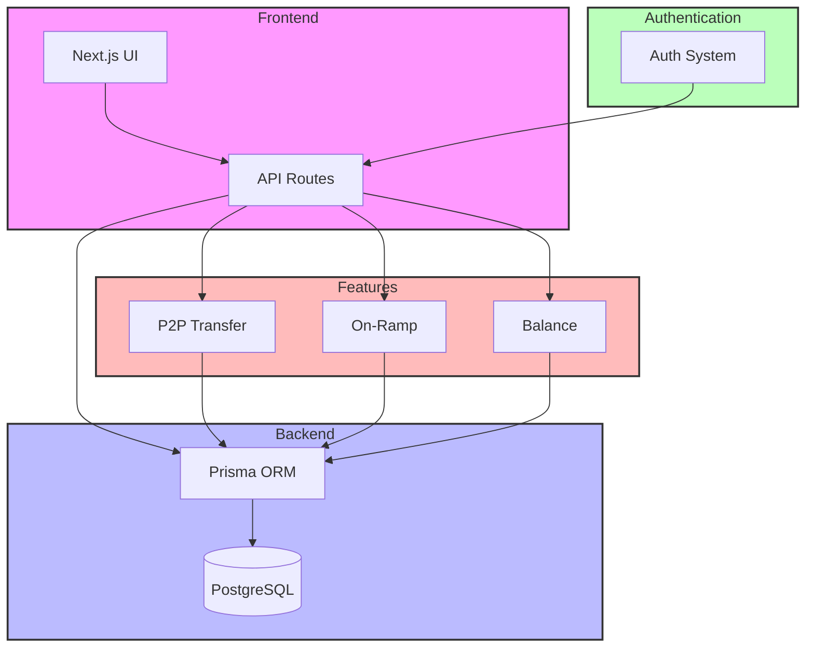

# Wallet Application

A full-stack wallet application built with Next.js, Prisma, and PostgreSQL. This application allows users to manage their balances, perform P2P transfers, and handle on-ramp transactions.

## Tech Stack


## How It Works



### Flow Description

1. **Frontend Layer**
   - Next.js UI components handle user interactions
   - API Routes process requests and communicate with the backend

2. **Backend Layer**
   - Prisma ORM manages database operations
   - PostgreSQL stores all application data

3. **Authentication Layer**
   - Handles user authentication and authorization
   - Secures API endpoints

4. **Feature Layer**
   - P2P Transfer: Manages peer-to-peer transactions
   - On-Ramp: Handles external fund deposits
   - Balance: Manages user account balances

## Prerequisites

- Node.js (v18 or higher)
- npm or yarn
- PostgreSQL database (or Neon.tech account for hosted PostgreSQL)
- Git

## Project Structure

```
├── packages/
│   ├── db/                 # Database package with Prisma
│   ├── ui/                 # Shared UI components
│   └── web/               # Next.js web application
├── package.json
└── README.md
```

## Setup Instructions

1. **Clone the repository**
   ```bash
   git clone <repository-url>
   cd <project-directory>
   ```

2. **Install dependencies**
   ```bash
   npm install
   ```

3. **Set up environment variables**

   Create a `.env` file in the `packages/db` directory:
   ```
   DATABASE_URL="your_postgresql_database_url"
   ```

   Create a `.env` file in the `packages/web` directory:
   ```
   NEXT_PUBLIC_API_URL="http://localhost:3000"
   ```

4. **Set up the database**
   ```bash
   cd packages/db
   npx prisma generate
   npx prisma db push
   ```

5. **Start the development server**
   ```bash
   cd ../web
   npm run dev
   ```

The application will be available at `http://localhost:3000`

## Features

- User authentication
- Balance management
- P2P transfers
- On-ramp transactions
- Merchant integration
- Real-time balance updates

## Database Schema

The application uses the following main models:

- **User**: Stores user information and authentication details
- **Balance**: Manages user balances
- **p2pTransfer**: Handles peer-to-peer transfers
- **OnRampTransaction**: Manages on-ramp transactions
- **Merchant**: Stores merchant information

## Development

### Running Tests
```bash
npm run test
```

### Building for Production
```bash
npm run build
```

### Starting Production Server
```bash
npm start
```

## Troubleshooting

If you encounter any issues:

1. **Prisma Client Generation Issues**
   - Make sure you're in the correct directory (`packages/db`)
   - Run `npx prisma generate` with administrator privileges
   - Check if the database URL is correct in your `.env` file

2. **Database Connection Issues**
   - Verify your database credentials
   - Ensure your database is running and accessible
   - Check if your IP is whitelisted (if using a hosted database)

3. **Build Issues**
   - Clear the `.next` cache: `rm -rf .next`
   - Remove `node_modules` and reinstall dependencies
   - Check for any TypeScript errors

## Contributing

1. Fork the repository
2. Create your feature branch (`git checkout -b feature/amazing-feature`)
3. Commit your changes (`git commit -m 'Add some amazing feature'`)
4. Push to the branch (`git push origin feature/amazing-feature`)
5. Open a Pull Request

## License

This project is licensed under the MIT License - see the LICENSE file for details.

